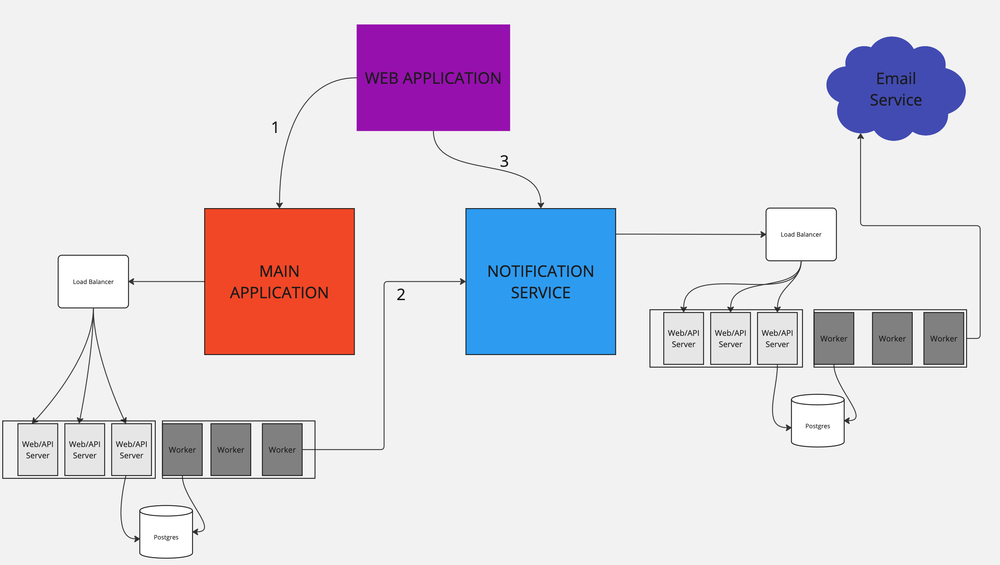

## Notification System Technical Documentation

### Approaches
There are two main ways we could incorporate notifications into our application.

1. We could include the notifcation code and logic within our main application codebase.
2. We could create a separate service that is responsible for consuming and sending notifications.

#### Option 1: Within the main application
This option would be the simplest way to implement notifications since we would just need to write our notifcation logic and then could share all other resources such as the infrastructure and database.
The downside of this approch is that it would be much more difficult to scale since we would be constrained by the resources of our main application.

#### Option 2: Notification Service
Spinning up a new service would allow us to scale the notification service independently of our main application since we can more easily scale out our web and worker resources and the database.

The drawback of this approach is that now we would be responsible for maintaing yet another service and have to worry about things such as database migrations, deployment, and monitoring and what happens if this service goes down.

Based on the product specs given I suggest going with option 2 as it provides the best way to scale and manage notifications in the long run without potential slowdowns in the main application.


### Architecture


At high level our notification service will have the following components:

1. API servers that will be responsible for consuming the raw notifications from our main application and also managing the current user's in-app notifications.
2. Worker servers that will be responsible for turning raw notifications into batch notifications, figuring out which users should receive them, and sending the email notifications.
3. A postgres database that will be responsible for storing notifications and user preferences.

Our main application will generate raw notifications and pass them to the notification service. 

When a user interacts with the application (e.g., uploading a file, creating a comment), the application inserts a raw notification into a queue table in PostgreSQL, which it fully manages. A worker server within the application processes these notifications in batches and sends them to the notification service.
Here is a pseudo code example of how this would work for uploading a file:

main application api: user uploads a file
```typescript
function calclulateInAppGroupKey(userId: number, board: string) {
    return `${userId}-${board}`;
}

function calclulateEmailGroupKey(board: string) {
    return `${board}`;
}

function userFileAdded(userId: number, board: string) {
    // deal with the logic of the file being added

    // create the raw notification in our application postgres table
    // assume we have access to the database with `db`
    await db.sql`
        INSERT INTO raw_notifications (triggered_by_user_id, notification_type, notification_data, in_app_group_key, email_group_key, created_at)
        VALUES (${userId}, 'asset-added', ${JSON.stringify({ board: board })}, ${calclulateInAppGroupKey(userId, board)}, ${calclulateEmailGroupKey(board)}, ${new Date()})
    `;
}
```

Then our main application worker can either have a long running process that continuously checks for raw notifications and sends them to the notification service or we can have a cron job that runs at a regular interval and sends the notifications. The former is preferred as it will more reliably send notifications as soon as they are created but the latter is simpler to implement and manage since if the process dies then we need to have a reliable way to restart it.

main application worker: process the raw notifications
```typescript
function sendRawNotificationsToNotificationService() {
    // assume we have access to the database with `db`

    // first create a db transaction
    db.transaction(async (tx) => {
        // get the raw notifications from the database that are ready to be sent
        // with select for update skip locked in batches of 1000 with the oldest first
        // using select for update skip locked will make sure that we only select rows that are not being processed by another worker
        const rawNotifications = await tx.sql`
        SELECT FOR UPDATE SKIP LOCKED * FROM raw_notifications WHERE in_app_group_key = ${inAppGroupKey} AND email_group_key = ${emailGroupKey} ORDER BY created_at ASC LIMIT 1000
    `;

        // send the raw notifications to the notification service
        
        const formattedNotifications = rawNotifications.map((notification) => {
            return {
                triggeredByUserId: notification.triggered_by_user_id,
                notificationType: notification.notification_type,
                notificationData: notification.notification_data,
                inAppGroupKey: notification.in_app_group_key,
                emailGroupKey: notification.email_group_key,
            }
        });

        // send the formatted notifications to the notification service
        // this will make a request to the notification service's `POST /notifications` endpoint to create a batch notification

        await notificationService.sendRawNotifications(formattedNotifications);

        // delete the raw notifications from the database now that they have been sent
        await tx.sql`
            DELETE FROM raw_notifications WHERE id IN (${rawNotifications.map(n => n.id).join(',')})
        `;

        db.commit();

        // note that we are assuming the notifications were sent successfully here. We need better error handling and logging to ensure that we can retry sending notifications that fail to send.
    });


}
```

**We delegate the groupping of notifcations to the main application as it has context of what the nofications are for and can generate a unique key for each group both for in-app and email.**


#### Notification Service Interface

The interface will have the following public endpoints that will be used by the main application and web app:

1. POST `/notifications` - This endpoint will be used by the main application to create raw notifications.
Example request body:
```json
[
    {
        "triggeredByUserId": 1,
        "notificationType": "asset-added",
        "notificationData": { "board": "123" },
        "inAppGroupKey": "1-123",
        "emailGroupKey": "123"
    },
    {
        "triggeredByUserId": 2,
        "notificationType": "comment-created",
        "notificationData": { "asset": "45" },
        "inAppGroupKey": "1-45",
        "emailGroupKey": "45"
    }
]
```
The notification service will then insert the notifications into the raw_notifications table.
```typescript
function createRawNotifications(notifications: RawNotification[]) {
    // assume we have access to the database with `db`
    await db.sql`
        INSERT INTO raw_notifications (triggered_by_user_id, notification_type, notification_data, in_app_group_key, email_group_key, created_at)
        VALUES (${notifications.map(n => n.triggeredByUserId).join(',')}, ${notifications.map(n => n.notificationType).join(',')}, ${notifications.map(n => JSON.stringify(n.notificationData)).join(',')}, ${notifications.map(n => n.inAppGroupKey).join(',')}, ${notifications.map(n => n.emailGroupKey).join(',')}, ${new Date()})
    `;

    // no need to send any response back other than the a success status code of 201
}
```

2. GET `/notifications/in-app` - This endpoint will be used by the current user to get their in-app notifications directly from the web app.

If it's feasible for our main application to provide a JWT for the logged in user then we can use that to authenticate requests to our notifcation service directly without using the main application as a middleman.

Example request:
```
GET /notifications/in-app
```
Assume the user is authenticated and has a JWT in the request headers.
```typescript
function getInAppNotifications(request: Request) {
    // assume we have access to the database with `db`
    const jwt = request.headers.get('Authorization');
    // use jwt library to decode the jwt
    const userId = jwt.decode(jwt).userId
    const inAppNotifications = await db.sql`
        SELECT * FROM user_in_app_notifications WHERE user_id = ${userId} AND (seen_at IS NULL OR read_at IS NULL) ORDER BY created_at DESC
    `;
    const formattedNotifications = inAppNotifications.map((notification) => {
        return {
            id: notification.id,
            notificationType: notification.notification_type,
            notificationData: notification.notification_data,
            createdAt: notification.created_at,
        }
    });
    return formattedNotifications;
}
```

POST `/notifications/in-app` - This endpoint will be used by the current user to mark their in-app notifications as seen or read.
Example request body:
```json
[
    {
        "id": 1,
        "seen_at": "2025-01-01T00:00:00Z",
        "read_at": "2025-01-01T00:00:00Z"
    },
    {
        "id": 2,
        "seen_at": "2025-01-01T00:00:00Z",
    }
]
```

### Database Schema of the notification service

Take a look at the `schema.sql file for the full database schema.


### Notification Service Architecture

Once we have the raw notifications in our database we need to through several steps to get them to the user:

1. We need to group the raw notifications by reciever type (in-app or email) and by their respective group keys and create a batch notification for each group.
```typescript
// pseudo code 
// 1. for each notification type (e.g., asset-added) and reciever type (in-app or email) we want to get latest (ordery by created_at asc limit 1) the raw notifications that don't have a batch notification id yet and make sure that the `created_at` + debounce duration is equal or less than the current time
// 2. if there are no raw notifications that meet the criteria then we can skip creating a batch notification for that notification type and reciever type
// 3. if there are raw notifications that meet the criteria then we can create a batch notification with the all the raw notifications of this group key that don't have a batch notification id yet

```
The worker needs to run the above logic for each notification type and reciever type either in a continuous loop or a cron job.

2. We need to take our newly created but not not processed batch notifications and figure out which users should receive them both for in-app and email and create user_in_app_notifications and user_email_notifications for each user.
```typescript
// pseudo code
// 1. for each batch notification we want to get all the users that have the notification type and reciever type in their preferences, `user_preferences` (lack of the row indicates that they want to receive the notification in-app and email). Note that we need to only look for users that are part of the orgainzation that the notification's triggered by user is part of. Also, we need to exclude the user that triggered the notification from the list of users that should receive the notification.
// 2. if there are users that have the notification type and reciever type in their preferences then we can create user_in_app_notifications and user_email_notifications for each user. Use the `notification_types` table to format the message for in-app and email using the templates.
```
3. For the `user_email_notifications` we need to send an email to the user with the notification.
-  We need to integrate with an external email serivce such as AWS SES or SendGrid to send the emails.
-  Loop through all rows in the `user_email_notifications` table and send an email to each user and mark the row as sent with the `sent_at` timestamp.

Note: Some providers have batch processing and if we are using a provider with such a feature then we should batch emails which will improve performance and potentially reduce costs if the provider is charging by the number of requests instead of the number of emails sent.

If we hit our quota for the email provider then we could just skip sending the emails and just marked them as processed but not sent. While this isn't ideal it's better than having to retry sending the emails since we don't want to overwhelm the email provider.


